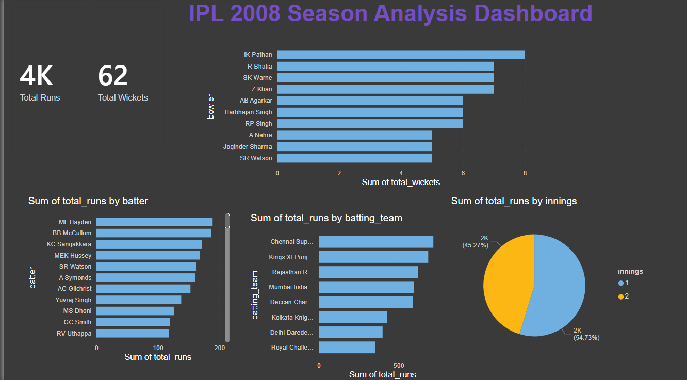

## 📊 IPL 2008 Season Analysis Dashboard

*Tool:* Power BI  
*Dataset:* IPL 2008 (MySQL/Kaggle)  

### Key Insights:
- 🏏 Top run scorers — ML Hayden, BB McCullum
- 🎯 Top wicket takers — IK Pathan, R Bhatia
- 🏆 Chennai Super Kings led team runs
- 📈 Innings 2 had 54.73% of total runs

### Features:
- KPI Cards (Total Runs, Total Wickets)
- Bowler & Batter performance charts
- Team-wise run distribution
- Innings comparison pie chart

